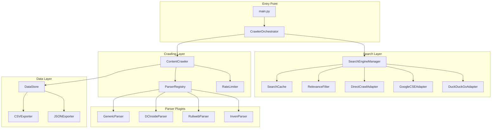

# Design Document

## Overview

본 설계 문서는 커뮤니티 크롤러 개선을 위한 아키텍처와 구현 방안을 정의한다. 기존 DuckDuckGo 검색 기반 크롤러를 확장하여 실제 게시글 본문 수집, 댓글 추출, 관련성 필터링, 사이트별 맞춤 파싱 기능을 추가한다.

## Architecture



### 스로틀링 대응 전략

DuckDuckGo API의 스로틀링 문제를 해결하기 위해 다음 전략을 적용한다:

1. **다중 검색 엔진 지원**: DuckDuckGo, Google Custom Search API, 직접 크롤링을 병행
2. **Failover 메커니즘**: 하나의 검색 엔진이 제한되면 자동으로 다른 엔진으로 전환
3. **검색 결과 캐싱**: 동일 쿼리에 대한 중복 요청 방지
4. **직접 크롤링**: 커뮤니티 사이트의 게시판 목록 페이지를 직접 크롤링하여 검색 API 의존도 감소
5. **랜덤 지연 (Jitter)**: 요청 간격에 랜덤성을 추가하여 봇 탐지 회피

## Components and Interfaces

### 1. CrawlerOrchestrator

전체 크롤링 프로세스를 조율하는 메인 컨트롤러.

```python
class CrawlerOrchestrator:
    def __init__(self, config: CrawlerConfig):
        self.search_engine = SearchEngine(config)
        self.content_crawler = ContentCrawler(config)
        self.data_store = DataStore(config)
    
    def crawl(self, keywords: List[str], sites: List[str]) -> CrawlResult:
        """키워드와 사이트 목록을 받아 크롤링 수행"""
        pass
```

### 2. SearchEngineManager & Adapters

다중 검색 엔진을 관리하고 failover를 처리.

```python
class SearchEngineManager:
    def __init__(self, config: CrawlerConfig):
        self.adapters: List[SearchAdapter] = []
        self.cache = SearchCache(config)
        self.relevance_filter = RelevanceFilter()
        self.current_adapter_index = 0
    
    def register_adapter(self, adapter: SearchAdapter) -> None:
        """검색 어댑터 등록"""
        pass
    
    def search(self, keywords: List[str], site: str, max_results: int) -> List[SearchResult]:
        """캐시 확인 후 검색 수행, 실패 시 다음 어댑터로 failover"""
        pass
    
    def _failover_search(self, keywords: List[str], site: str, max_results: int) -> List[SearchResult]:
        """현재 어댑터 실패 시 다음 어댑터로 전환"""
        pass

class SearchAdapter(ABC):
    @abstractmethod
    def search(self, keywords: List[str], site: str, max_results: int) -> List[SearchResult]:
        """검색 수행"""
        pass
    
    @abstractmethod
    def is_available(self) -> bool:
        """어댑터 사용 가능 여부"""
        pass

class DuckDuckGoAdapter(SearchAdapter):
    """DuckDuckGo 검색 API 어댑터"""
    pass

class GoogleCSEAdapter(SearchAdapter):
    """Google Custom Search Engine 어댑터 (API 키 필요)"""
    pass

class DirectCrawlAdapter(SearchAdapter):
    """커뮤니티 사이트 직접 크롤링 어댑터"""
    def __init__(self, parser_registry: ParserRegistry):
        self.parser_registry = parser_registry
    
    def search(self, keywords: List[str], site: str, max_results: int) -> List[SearchResult]:
        """사이트의 게시판 목록 페이지를 직접 크롤링하여 검색"""
        pass

class SearchCache:
    def __init__(self, config: CrawlerConfig):
        self.cache: Dict[str, Tuple[List[SearchResult], datetime]] = {}
        self.ttl = config.cache_ttl  # 캐시 유효 시간 (초)
    
    def get(self, query_key: str) -> Optional[List[SearchResult]]:
        """캐시된 결과 반환, 만료 시 None"""
        pass
    
    def set(self, query_key: str, results: List[SearchResult]) -> None:
        """검색 결과 캐싱"""
        pass

class RelevanceFilter:
    def calculate_score(self, content: str, keywords: List[str]) -> float:
        """키워드 기반 관련성 점수 계산 (0.0 ~ 1.0)"""
        pass
    
    def filter(self, results: List[SearchResult], threshold: float = 0.5) -> List[SearchResult]:
        """임계값 이상의 결과만 필터링"""
        pass
```

### 3. ContentCrawler

URL에 접속하여 실제 콘텐츠를 추출.

```python
class ContentCrawler:
    def __init__(self, config: CrawlerConfig):
        self.rate_limiter = RateLimiter(config)
        self.parser_registry = ParserRegistry()
    
    def crawl_post(self, url: str) -> PostContent:
        """게시글 본문 및 메타데이터 추출"""
        pass
    
    def crawl_comments(self, url: str, max_pages: int = 3) -> List[Comment]:
        """댓글 추출 (최대 페이지 수 제한)"""
        pass
```

### 4. RateLimiter

도메인별 요청 속도 제어 및 랜덤 지연(Jitter) 적용.

```python
class RateLimiter:
    def __init__(self, config: CrawlerConfig):
        self.domain_delays: Dict[str, float] = {}
        self.last_request: Dict[str, datetime] = {}
        self.default_delay = 3.0
        self.jitter_range = (0.5, 2.0)  # 랜덤 지연 범위 (초)
    
    def wait(self, domain: str) -> None:
        """도메인별 대기 시간 + 랜덤 지연 적용"""
        pass
    
    def handle_rate_limit(self, domain: str, retry_count: int) -> bool:
        """429 응답 시 지수 백오프 처리, 재시도 가능 여부 반환"""
        pass
    
    def _add_jitter(self, base_delay: float) -> float:
        """기본 지연에 랜덤 지연 추가"""
        pass
```

### 5. ParserRegistry & Site Parsers

사이트별 맞춤 파서 관리.

```python
class ParserRegistry:
    def __init__(self):
        self.parsers: Dict[str, ContentParser] = {}
        self.generic_parser = GenericParser()
    
    def register(self, domain: str, parser: ContentParser) -> None:
        """사이트별 파서 등록"""
        pass
    
    def get_parser(self, url: str) -> ContentParser:
        """URL에 맞는 파서 반환, 없으면 GenericParser"""
        pass

class ContentParser(ABC):
    @abstractmethod
    def parse_post(self, html: str) -> PostContent:
        """게시글 파싱"""
        pass
    
    @abstractmethod
    def parse_comments(self, html: str) -> List[Comment]:
        """댓글 파싱"""
        pass
```

### 6. DataStore

데이터 저장 및 내보내기.

```python
class DataStore:
    def __init__(self, config: CrawlerConfig):
        self.posts: List[PostContent] = []
        self.output_dir = config.output_dir
    
    def add_post(self, post: PostContent) -> None:
        """게시글 추가"""
        pass
    
    def export_json(self, filename: str) -> None:
        """JSON 형식으로 내보내기"""
        pass
    
    def export_csv(self, filename: str) -> None:
        """CSV 형식으로 내보내기"""
        pass
```

## Data Models

```python
from dataclasses import dataclass
from datetime import datetime
from typing import List, Optional

@dataclass
class CrawlerConfig:
    output_dir: str = "data"
    default_delay: float = 3.0
    max_retries: int = 3
    relevance_threshold: float = 0.5
    max_comment_pages: int = 3
    cache_ttl: int = 3600  # 검색 캐시 유효 시간 (초)
    jitter_range: Tuple[float, float] = (0.5, 2.0)  # 랜덤 지연 범위
    google_api_key: Optional[str] = None  # Google CSE API 키
    google_cse_id: Optional[str] = None  # Google CSE ID

@dataclass
class SearchResult:
    url: str
    title: str
    snippet: str
    relevance_score: float

@dataclass
class PostContent:
    url: str
    title: str
    body: str
    author: Optional[str]
    created_at: Optional[datetime]
    view_count: int
    like_count: int
    site: str
    keyword: str
    comments: List['Comment']

@dataclass
class Comment:
    author: str
    content: str
    created_at: Optional[datetime]
    like_count: int
```


## Correctness Properties

*A property is a characteristic or behavior that should hold true across all valid executions of a system-essentially, a formal statement about what the system should do. Properties serve as the bridge between human-readable specifications and machine-verifiable correctness guarantees.*

### Property 1: Serialization Round-Trip

*For any* valid PostContent 객체, JSON으로 직렬화한 후 역직렬화하면 원본과 동일한 객체가 되어야 한다.

**Validates: Requirements 1.4, 6.4**

### Property 2: Parsed Content Contains Required Fields

*For any* 유효한 HTML 입력에 대해, 파싱된 PostContent는 title, body, site, url 필드를 반드시 포함해야 하며, 파싱된 Comment는 author, content 필드를 반드시 포함해야 한다.

**Validates: Requirements 1.2, 2.2**

### Property 3: Relevance Score Range and Filtering

*For any* 검색 결과와 키워드 목록에 대해, 계산된 Relevance_Score는 0.0 이상 1.0 이하이며, 필터링 후 결과는 모두 threshold 이상의 점수를 가져야 한다.

**Validates: Requirements 3.1, 3.2**

### Property 4: Keyword Frequency Affects Score

*For any* 두 개의 콘텐츠 A와 B에서, A가 B보다 키워드를 더 많이 포함하면 A의 Relevance_Score는 B 이상이어야 한다.

**Validates: Requirements 3.3**

### Property 5: URL Deduplication

*For any* URL 목록에 대해, 중복 제거 후 결과의 모든 URL은 고유해야 하며, 원본에 있던 모든 고유 URL이 결과에 포함되어야 한다.

**Validates: Requirements 3.4**

### Property 6: Parser Selection by Domain

*For any* URL에 대해, 해당 도메인에 등록된 파서가 있으면 그 파서가 선택되고, 없으면 GenericParser가 선택되어야 한다.

**Validates: Requirements 4.1, 4.3**

### Property 7: Rate Limiter Minimum Delay

*For any* 동일 도메인에 대한 연속 요청에서, 두 요청 사이의 시간 간격은 설정된 최소 지연 시간 이상이어야 한다.

**Validates: Requirements 5.1**

### Property 8: Exponential Backoff on Rate Limit

*For any* 429 응답 후 재시도 시, n번째 재시도의 대기 시간은 (n-1)번째 재시도의 대기 시간보다 커야 한다 (지수 백오프).

**Validates: Requirements 5.2**

### Property 9: Domain-Specific Rate Limit Settings

*For any* 도메인별 설정이 적용된 경우, 해당 도메인의 요청은 개별 설정된 지연 시간을 따라야 한다.

**Validates: Requirements 5.4**

### Property 10: Post-Comment Relationship Integrity

*For any* 저장된 PostContent에 대해, 해당 게시글의 comments 필드에 있는 모든 Comment는 해당 게시글에 속한 것이어야 한다.

**Validates: Requirements 6.1**

### Property 11: Search Adapter Failover

*For any* 검색 요청에서 현재 어댑터가 실패하면, 다음 사용 가능한 어댑터로 자동 전환되어야 하며, 모든 어댑터가 실패할 때까지 시도해야 한다.

**Validates: Requirements 7.2**

### Property 12: Search Cache Consistency

*For any* 검색 쿼리에 대해, 캐시에 유효한 결과가 있으면 캐시된 결과를 반환하고, 만료되었거나 없으면 새로운 검색을 수행해야 한다.

**Validates: Requirements 7.3, 7.4**

### Property 13: Jitter Range Compliance

*For any* 요청에 적용되는 랜덤 지연은 설정된 jitter_range 범위 내에 있어야 한다.

**Validates: Requirements 8.1, 8.2**

## Error Handling

### 네트워크 오류
- HTTP 요청 실패 시 최대 3회 재시도
- 타임아웃 설정: 연결 10초, 읽기 30초
- 429 응답 시 지수 백오프 (2초, 4초, 8초)

### 파싱 오류
- 특정 파서 실패 시 GenericParser로 폴백
- 필수 필드 추출 실패 시 None으로 설정하고 로깅
- 전체 파싱 실패 시 해당 URL 건너뛰고 계속 진행

### 저장 오류
- 파일 쓰기 실패 시 임시 파일에 백업
- 디스크 공간 부족 시 경고 로깅 후 메모리에 유지

## Testing Strategy

### Property-Based Testing

본 프로젝트는 **Hypothesis** 라이브러리를 사용하여 property-based testing을 수행한다.

각 property-based test는 최소 100회 반복 실행하며, 다음 형식의 주석으로 correctness property를 명시한다:
```python
# **Feature: community-crawler-enhancement, Property {number}: {property_text}**
```

### Unit Testing

pytest를 사용하여 다음 항목에 대한 unit test를 작성한다:
- 각 사이트별 파서의 기본 동작
- Rate limiter의 지연 시간 계산
- 데이터 모델의 유효성 검증

### Integration Testing

실제 사이트에 대한 end-to-end 테스트:
- 검색 → 크롤링 → 저장 전체 흐름
- 각 커뮤니티 사이트별 파싱 정확도 검증
