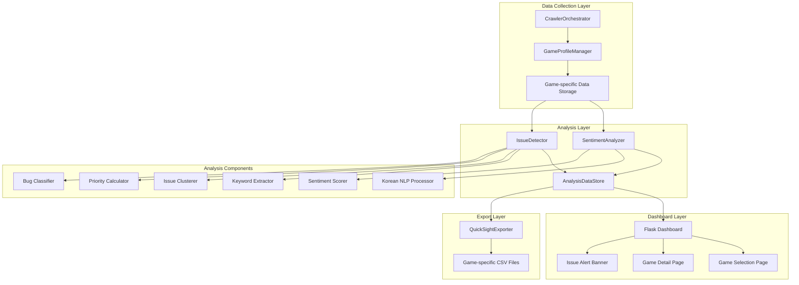

# Design Document

## Overview

본 설계 문서는 게임별 커뮤니티 반응 분석 대시보드 개선을 위한 아키텍처와 구현 방안을 정의한다. 기존 크롤러 시스템을 확장하여 감성 분석, 이슈 탐지, 트렌드 분석 기능을 추가하고, 게임별로 분리된 대시보드와 QuickSight 연동을 지원한다.

## Architecture



## Components and Interfaces

### 1. GameProfileManager

게임별 프로필 및 데이터 경로를 관리하는 컴포넌트.

```python
@dataclass
class GameProfile:
    game_id: str                    # 게임 고유 ID (kebab-case)
    game_name: str                  # 게임 표시명
    keywords: List[str]             # 검색 키워드 목록
    target_sites: List[str]         # 대상 사이트 목록
    data_dir: str                   # 데이터 저장 디렉토리
    quicksight_dir: str             # QuickSight 내보내기 디렉토리

class GameProfileManager:
    def __init__(self, base_data_dir: str = "data"):
        self.profiles: Dict[str, GameProfile] = {}
        self.base_data_dir = base_data_dir
    
    def register_game(self, profile: GameProfile) -> None:
        """게임 프로필 등록"""
        pass
    
    def get_profile(self, game_id: str) -> Optional[GameProfile]:
        """게임 프로필 조회"""
        pass
    
    def get_data_path(self, game_id: str) -> str:
        """게임별 데이터 경로 반환"""
        pass
    
    def list_games(self) -> List[GameProfile]:
        """등록된 모든 게임 목록 반환"""
        pass
```

### 2. SentimentAnalyzer

한국어 텍스트의 감성을 분석하는 컴포넌트.

```python
@dataclass
class SentimentResult:
    score: float                    # -1.0 ~ 1.0
    label: str                      # "positive", "negative", "neutral"
    confidence: float               # 0.0 ~ 1.0

class SentimentAnalyzer:
    def __init__(self):
        self.positive_words: Set[str] = set()
        self.negative_words: Set[str] = set()
        self._load_lexicon()
    
    def analyze(self, text: str) -> SentimentResult:
        """텍스트 감성 분석"""
        pass
    
    def analyze_post(self, post: PostContent) -> SentimentResult:
        """게시글 전체 감성 분석 (제목 + 본문)"""
        pass
    
    def analyze_comments(self, comments: List[Comment]) -> List[SentimentResult]:
        """댓글 목록 감성 분석"""
        pass
    
    def _load_lexicon(self) -> None:
        """한국어 감성 사전 로드"""
        pass
    
    def _calculate_score(self, text: str) -> float:
        """감성 점수 계산"""
        pass
```

### 3. IssueDetector

커뮤니티에서 반복되는 이슈를 탐지하고 우선순위를 매기는 컴포넌트.

```python
@dataclass
class KeywordCluster:
    cluster_id: str
    keywords: List[str]             # 클러스터에 포함된 키워드들
    representative: str             # 대표 키워드
    post_count: int                 # 관련 게시글 수
    total_views: int                # 총 조회수
    total_comments: int             # 총 댓글수

@dataclass
class DetectedIssue:
    issue_id: str
    title: str                      # 이슈 제목 (대표 키워드 기반)
    cluster: KeywordCluster
    priority_score: float           # 우선순위 점수
    is_hot: bool                    # Hot Issue 여부
    is_bug: bool                    # 버그/오류 관련 여부
    severity: str                   # "critical", "high", "medium", "low"
    related_posts: List[str]        # 관련 게시글 URL 목록
    first_seen: datetime            # 최초 탐지 시간
    sentiment_avg: float            # 평균 감성 점수

class IssueDetector:
    def __init__(self, sentiment_analyzer: SentimentAnalyzer):
        self.sentiment_analyzer = sentiment_analyzer
        self.bug_keywords = ["버그", "오류", "에러", "렉", "튕김", "접속불가", 
                            "크래시", "프리징", "멈춤", "안됨", "불가"]
    
    def extract_keywords(self, posts: List[PostContent]) -> List[str]:
        """게시글에서 주요 키워드 추출"""
        pass
    
    def cluster_keywords(self, keywords: List[str]) -> List[KeywordCluster]:
        """유사 키워드 클러스터링"""
        pass
    
    def detect_issues(self, posts: List[PostContent]) -> List[DetectedIssue]:
        """이슈 탐지 및 우선순위화"""
        pass
    
    def calculate_priority(self, cluster: KeywordCluster, posts: List[PostContent]) -> float:
        """이슈 우선순위 점수 계산"""
        pass
    
    def classify_bug(self, post: PostContent) -> bool:
        """버그/오류 관련 게시글 분류"""
        pass
    
    def calculate_severity(self, issue: DetectedIssue) -> str:
        """버그 심각도 계산"""
        pass
    
    def detect_hot_issues(self, issues: List[DetectedIssue], threshold_percentile: float = 0.9) -> List[DetectedIssue]:
        """Hot Issue 탐지 (상위 10%)"""
        pass
```

### 4. TrendAnalyzer

시간에 따른 감성 및 이슈 변화를 분석하는 컴포넌트.

```python
@dataclass
class TrendPoint:
    date: datetime
    value: float
    count: int

@dataclass
class TrendData:
    metric_name: str                # "sentiment", "issue_mentions", etc.
    period: str                     # "daily", "weekly"
    data_points: List[TrendPoint]

class TrendAnalyzer:
    def __init__(self):
        pass
    
    def analyze_sentiment_trend(self, posts: List[PostContent], 
                                 period: str = "daily") -> TrendData:
        """감성 점수 시계열 분석"""
        pass
    
    def analyze_issue_trend(self, posts: List[PostContent], 
                            issue: DetectedIssue,
                            period: str = "daily") -> TrendData:
        """특정 이슈 언급 빈도 추이"""
        pass
    
    def detect_sentiment_spike(self, trend: TrendData, 
                               threshold: float = -0.3) -> List[TrendPoint]:
        """부정적 감성 급증 탐지"""
        pass
```

### 5. AnalysisDataStore

분석 결과를 저장하고 관리하는 컴포넌트.

```python
@dataclass
class GameAnalysisResult:
    game_id: str
    analyzed_at: datetime
    total_posts: int
    total_comments: int
    sentiment_distribution: Dict[str, int]  # {"positive": n, "negative": n, "neutral": n}
    sentiment_avg: float
    issues: List[DetectedIssue]
    hot_issues: List[DetectedIssue]
    bug_issues: List[DetectedIssue]
    sentiment_trend: TrendData
    posts_with_sentiment: List[Tuple[PostContent, SentimentResult]]

class AnalysisDataStore:
    def __init__(self, base_dir: str = "analysis_data"):
        self.base_dir = base_dir
    
    def save_analysis(self, game_id: str, result: GameAnalysisResult) -> str:
        """분석 결과 저장"""
        pass
    
    def load_analysis(self, game_id: str) -> Optional[GameAnalysisResult]:
        """분석 결과 로드"""
        pass
    
    def get_latest_analysis(self, game_id: str) -> Optional[GameAnalysisResult]:
        """최신 분석 결과 조회"""
        pass
```

### 6. QuickSightExporter (확장)

게임별 QuickSight 데이터 내보내기.

```python
class GameQuickSightExporter:
    def __init__(self, base_output_dir: str = "quicksight_data"):
        self.base_output_dir = base_output_dir
    
    def export_game_data(self, game_id: str, 
                         posts: List[PostContent],
                         analysis: GameAnalysisResult) -> Dict[str, str]:
        """게임별 QuickSight 데이터 내보내기
        
        Returns:
            생성된 파일 경로 딕셔너리
            {"posts": "path", "comments": "path", "sentiment": "path", "issues": "path"}
        """
        pass
    
    def _export_posts_csv(self, game_id: str, posts: List[PostContent]) -> str:
        """게시글 CSV 내보내기"""
        pass
    
    def _export_comments_csv(self, game_id: str, posts: List[PostContent]) -> str:
        """댓글 CSV 내보내기"""
        pass
    
    def _export_sentiment_csv(self, game_id: str, 
                              posts_with_sentiment: List[Tuple[PostContent, SentimentResult]]) -> str:
        """감성 분석 결과 CSV 내보내기"""
        pass
    
    def _export_issues_csv(self, game_id: str, issues: List[DetectedIssue]) -> str:
        """이슈 목록 CSV 내보내기"""
        pass
    
    def get_game_export_path(self, game_id: str) -> str:
        """게임별 내보내기 경로 반환: quicksight_data/{game_id}/"""
        pass
```

### 7. Dashboard (Flask 확장)

게임별 분석 대시보드.

```python
# dashboard/app.py 확장

@app.route('/')
def index():
    """게임 선택 메인 페이지"""
    pass

@app.route('/game/<game_id>')
def game_dashboard(game_id: str):
    """게임별 상세 대시보드"""
    pass

@app.route('/game/<game_id>/issues')
def game_issues(game_id: str):
    """게임별 이슈 목록"""
    pass

@app.route('/game/<game_id>/bugs')
def game_bugs(game_id: str):
    """게임별 버그 리포트"""
    pass

@app.route('/api/game/<game_id>/sentiment')
def api_game_sentiment(game_id: str):
    """게임별 감성 분석 API"""
    pass

@app.route('/api/game/<game_id>/issues')
def api_game_issues(game_id: str):
    """게임별 이슈 목록 API"""
    pass

@app.route('/api/game/<game_id>/trend')
def api_game_trend(game_id: str):
    """게임별 트렌드 API"""
    pass
```

## Data Models

```python
from dataclasses import dataclass, field
from datetime import datetime
from typing import List, Dict, Optional, Tuple
from enum import Enum

class SentimentLabel(Enum):
    POSITIVE = "positive"
    NEGATIVE = "negative"
    NEUTRAL = "neutral"

class IssueSeverity(Enum):
    CRITICAL = "critical"
    HIGH = "high"
    MEDIUM = "medium"
    LOW = "low"

@dataclass
class GameProfile:
    """게임 프로필"""
    game_id: str
    game_name: str
    keywords: List[str]
    target_sites: List[str]
    data_dir: str = ""
    quicksight_dir: str = ""
    
    def __post_init__(self):
        if not self.data_dir:
            self.data_dir = f"data/{self.game_id}"
        if not self.quicksight_dir:
            self.quicksight_dir = f"quicksight_data/{self.game_id}"

@dataclass
class SentimentResult:
    """감성 분석 결과"""
    score: float                    # -1.0 ~ 1.0
    label: SentimentLabel
    confidence: float = 1.0
    
    def to_dict(self) -> dict:
        return {
            "score": self.score,
            "label": self.label.value,
            "confidence": self.confidence
        }

@dataclass
class KeywordCluster:
    """키워드 클러스터"""
    cluster_id: str
    keywords: List[str]
    representative: str
    post_count: int = 0
    total_views: int = 0
    total_comments: int = 0
    
    def to_dict(self) -> dict:
        return {
            "cluster_id": self.cluster_id,
            "keywords": self.keywords,
            "representative": self.representative,
            "post_count": self.post_count,
            "total_views": self.total_views,
            "total_comments": self.total_comments
        }

@dataclass
class DetectedIssue:
    """탐지된 이슈"""
    issue_id: str
    title: str
    cluster: KeywordCluster
    priority_score: float
    is_hot: bool = False
    is_bug: bool = False
    severity: IssueSeverity = IssueSeverity.LOW
    related_posts: List[str] = field(default_factory=list)
    first_seen: Optional[datetime] = None
    sentiment_avg: float = 0.0
    
    def to_dict(self) -> dict:
        return {
            "issue_id": self.issue_id,
            "title": self.title,
            "cluster": self.cluster.to_dict(),
            "priority_score": self.priority_score,
            "is_hot": self.is_hot,
            "is_bug": self.is_bug,
            "severity": self.severity.value,
            "related_posts": self.related_posts,
            "first_seen": self.first_seen.isoformat() if self.first_seen else None,
            "sentiment_avg": self.sentiment_avg
        }

@dataclass
class TrendPoint:
    """트렌드 데이터 포인트"""
    date: datetime
    value: float
    count: int = 0
    
    def to_dict(self) -> dict:
        return {
            "date": self.date.isoformat(),
            "value": self.value,
            "count": self.count
        }

@dataclass
class TrendData:
    """트렌드 데이터"""
    metric_name: str
    period: str
    data_points: List[TrendPoint] = field(default_factory=list)
    
    def to_dict(self) -> dict:
        return {
            "metric_name": self.metric_name,
            "period": self.period,
            "data_points": [p.to_dict() for p in self.data_points]
        }

@dataclass
class GameAnalysisResult:
    """게임 분석 결과"""
    game_id: str
    analyzed_at: datetime
    total_posts: int
    total_comments: int
    sentiment_distribution: Dict[str, int]
    sentiment_avg: float
    issues: List[DetectedIssue]
    hot_issues: List[DetectedIssue]
    bug_issues: List[DetectedIssue]
    sentiment_trend: Optional[TrendData] = None
    
    def to_dict(self) -> dict:
        return {
            "game_id": self.game_id,
            "analyzed_at": self.analyzed_at.isoformat(),
            "total_posts": self.total_posts,
            "total_comments": self.total_comments,
            "sentiment_distribution": self.sentiment_distribution,
            "sentiment_avg": self.sentiment_avg,
            "issues": [i.to_dict() for i in self.issues],
            "hot_issues": [i.to_dict() for i in self.hot_issues],
            "bug_issues": [i.to_dict() for i in self.bug_issues],
            "sentiment_trend": self.sentiment_trend.to_dict() if self.sentiment_trend else None
        }
```


## Correctness Properties

*A property is a characteristic or behavior that should hold true across all valid executions of a system-essentially, a formal statement about what the system should do. Properties serve as the bridge between human-readable specifications and machine-verifiable correctness guarantees.*


### Property 1: Game Data Path Consistency

*For any* 게임 ID에 대해, 데이터 저장 경로는 `data/{game_id}/` 형식이어야 하고, QuickSight 내보내기 경로는 `quicksight_data/{game_id}/` 형식이어야 한다.

**Validates: Requirements 1.1, 1.5, 6.4**

### Property 2: Game Data Filtering

*For any* 게임 ID와 여러 게임의 데이터가 혼합된 목록에서, 특정 게임으로 필터링하면 결과의 모든 데이터는 해당 게임 ID에 속해야 한다.

**Validates: Requirements 1.3**

### Property 3: GameProfile Required Fields

*For any* GameProfile 객체는 game_id, game_name, keywords, target_sites 필드를 반드시 포함해야 하며, game_id는 비어있지 않아야 한다.

**Validates: Requirements 1.4**

### Property 4: Sentiment Score Range

*For any* 텍스트에 대해 SentimentAnalyzer가 반환하는 Sentiment_Score는 -1.0 이상 1.0 이하의 값이어야 하며, SentimentResult 객체를 반환해야 한다.

**Validates: Requirements 2.1, 2.2**

### Property 5: Negative Post Filtering

*For any* 게시글 목록에서 부정적 게시글 필터링을 적용하면, 결과의 모든 게시글은 Sentiment_Score가 -0.3 미만이어야 한다.

**Validates: Requirements 2.4**

### Property 6: Keyword Extraction Non-Empty

*For any* 비어있지 않은 게시글 목록에서 키워드 추출을 수행하면, 결과는 빈 목록이 아니어야 한다 (게시글에 텍스트가 있는 경우).

**Validates: Requirements 3.1**

### Property 7: Keyword Clustering Completeness

*For any* 키워드 목록에 대해 클러스터링을 수행하면, 모든 입력 키워드는 정확히 하나의 클러스터에 속해야 한다.

**Validates: Requirements 3.2**

### Property 8: Issue Priority Monotonicity

*For any* 두 이슈 A와 B에서, A의 조회수, 댓글수, 언급 빈도가 모두 B 이상이면 A의 Issue_Priority는 B 이상이어야 한다.

**Validates: Requirements 3.3**

### Property 9: Hot Issue Top Percentile

*For any* 이슈 목록에서 Hot Issue로 분류된 이슈들은 Issue_Priority 기준 상위 10%에 해당해야 한다.

**Validates: Requirements 3.4**

### Property 10: Issue List Sorting

*For any* 이슈 목록을 우선순위로 정렬하면, 결과는 Issue_Priority 내림차순이어야 한다.

**Validates: Requirements 3.5**

### Property 11: Sentiment Trend Calculation

*For any* 날짜가 있는 게시글 목록에 대해 일별 트렌드를 계산하면, 각 날짜의 감성 평균은 해당 날짜 게시글들의 감성 점수 평균과 일치해야 한다.

**Validates: Requirements 4.1**

### Property 12: Date Range Filtering

*For any* 시작일과 종료일로 필터링하면, 결과의 모든 데이터는 해당 기간 내의 날짜를 가져야 한다.

**Validates: Requirements 4.3**

### Property 13: Post Sorting Options

*For any* 게시글 목록에 대해 조회수, 댓글수, 감성 점수로 정렬하면, 결과는 해당 필드 기준으로 올바르게 정렬되어야 한다.

**Validates: Requirements 5.4**

### Property 14: Multi-Filter Application

*For any* 필터 조건(기간, 사이트, 감성, 이슈 유형)을 적용하면, 결과의 모든 데이터는 모든 필터 조건을 만족해야 한다.

**Validates: Requirements 5.5**

### Property 15: QuickSight Export Files

*For any* 게임에 대해 QuickSight 내보내기를 수행하면, posts.csv, comments.csv, sentiment.csv, issues.csv 4개 파일이 모두 생성되어야 한다.

**Validates: Requirements 6.2**

### Property 16: CSV Format Compatibility

*For any* 생성된 CSV 파일은 UTF-8 인코딩이어야 하고, 날짜 필드는 ISO 8601 형식(YYYY-MM-DD)이어야 한다.

**Validates: Requirements 6.3**

### Property 17: Bug Keyword Detection

*For any* "버그", "오류", "에러", "렉", "튕김", "접속불가" 키워드가 포함된 게시글은 버그 관련 게시글로 분류되어야 한다.

**Validates: Requirements 7.1, 7.2**

### Property 18: Bug Severity Monotonicity

*For any* 두 버그 이슈 A와 B에서, A의 언급 빈도와 부정적 감성 강도가 모두 B보다 높으면 A의 심각도는 B 이상이어야 한다.

**Validates: Requirements 7.4**

### Property 19: Urgent Alert Classification

*For any* 이슈에 대해 24시간 내 관련 게시글이 10개 이상이면 긴급 알림으로 분류되어야 한다.

**Validates: Requirements 8.4**

## Error Handling

### 감성 분석 오류
- 텍스트가 비어있거나 None인 경우 중립(0.0) 점수 반환
- 분석 실패 시 기본값 반환 및 로깅

### 이슈 탐지 오류
- 게시글이 없는 경우 빈 이슈 목록 반환
- 키워드 추출 실패 시 제목만으로 분석 시도

### 데이터 저장 오류
- 디렉토리 생성 실패 시 기본 디렉토리 사용
- 파일 쓰기 실패 시 임시 파일에 백업

### QuickSight 내보내기 오류
- CSV 생성 실패 시 개별 파일 단위로 재시도
- 인코딩 오류 시 문제 문자 대체 후 저장

## Testing Strategy

### Property-Based Testing

본 프로젝트는 **Hypothesis** 라이브러리를 사용하여 property-based testing을 수행한다.

각 property-based test는 최소 100회 반복 실행하며, 다음 형식의 주석으로 correctness property를 명시한다:
```python
# **Feature: game-analytics-dashboard, Property {number}: {property_text}**
```

### Unit Testing

pytest를 사용하여 다음 항목에 대한 unit test를 작성한다:
- SentimentAnalyzer의 한국어 감성 사전 로드 및 기본 동작
- IssueDetector의 버그 키워드 탐지
- GameProfileManager의 프로필 등록 및 조회
- QuickSightExporter의 CSV 파일 생성

### Integration Testing

실제 데이터에 대한 end-to-end 테스트:
- 크롤링 → 분석 → 대시보드 표시 전체 흐름
- QuickSight 내보내기 및 파일 검증

